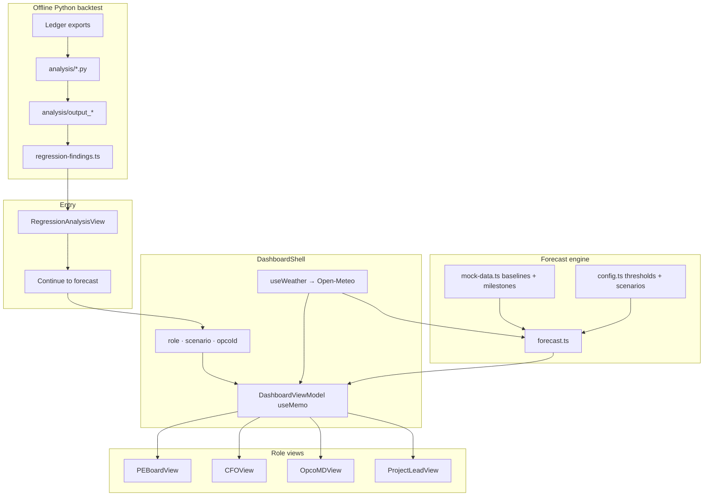

# Pidgecast

**Weather-aware revenue forecasting for roofing operators and portfolio finance teams.**

Built for the **Altis Groep Challenge** (Harlem hackathon, June 2026). Pidgecast connects a real weather→revenue backtest on Dutch roofing ledger data to a live, explainable 14-week forecast — so PE boards, CFOs, operating MDs, and project leads can act on the same numbers from different angles.

---

## Table of contents

- [The problem](#the-problem)
- [Our thinking](#our-thinking)
- [How the demo works](#how-the-demo-works)
- [Architecture](#architecture)
- [Forecast model](#forecast-model)
- [Regression backtest](#regression-backtest)
- [Repository structure](#repository-structure)
- [Getting started](#getting-started)
- [Deploying](#deploying)
- [Configuration](#configuration)
- [Data & limitations](#data--limitations)
- [Roadmap](#roadmap)

---

## The problem

Roofing revenue is not a smooth monthly line. It splits into two very different streams:

| Stream | Behaviour | Weather sensitivity |
|--------|-----------|---------------------|
| **Recurring** | Maintenance, small repairs, service contracts | Low — mostly stable |
| **Project billing** | Milestone-based large jobs | High — crew capacity drives timing |

Portfolio lenders and operators still plan with static budgets. When frost, rain, or wind reduce workable days, **project billing slips** — but finance tools rarely show *why* a forecast moved, or *how much* of the portfolio is actually exposed.

Pidgecast answers three questions in one product:

1. **Is there statistical proof** that weather moves revenue? (Regression, on real ledger data.)
2. **What does the next 14 weeks look like** under live weather and stress scenarios? (Forecast engine.)
3. **Who needs to act, and on what?** (Role-specific views with audit trails.)

---

## Our thinking

These principles shaped every design decision:

### 1. Proof before forecast

Users should not trust a black-box projection. The app **opens on Regression Analysis** — the FE-OLS backtest on 2023–2026 transaction data — with a **Continue to forecast →** path into the operational views. The coefficient (~**+11–14% revenue per workable day/week**) is the foundation of every forecast number downstream.

### 2. Two streams, not one blended revenue line

Applying the weather coefficient to *all* revenue overstates weather sensitivity by roughly **40%**. The forecast engine treats **recurring** and **project billing** separately: recurring moves slightly; project billing carries the swing.

### 3. Explainability over precision theatre

Every weekly forecast includes a step-by-step **audit trail** (baseline → workable days → weather impact → scenario lever → covenant headroom). If a CFO cannot trace a number, it does not ship.

### 4. Asymmetric scenarios

**Wet-quarter downside is intentionally larger than dry-quarter upside.** Crew capacity, pipeline depth, and scheduling limits cap how much extra work favourable weather buys — matching how roofing operators actually behave.

### 5. One model, many lenses

`DashboardShell` computes a single `DashboardViewModel` and passes it to role views. PE Board, CFO, Opco MD, and Project Lead are **filters on the same truth**, not separate spreadsheets.

### 6. Accrual first, cash second

This demo forecasts **recognized revenue timing** (accrual / milestone billing), not bank cash. Payment terms, VAT, and AR aging are natural extensions; the UI is explicit about what is and is not modelled.

### 7. Client-side weather, no backend required

Live capacity uses **Open-Meteo** directly from the browser. If the API is unreachable, synthetic fallback weather keeps the demo running — with a visible warning.

---

## How the demo works

### Entry flow

```
Regression Analysis  →  Continue to forecast  →  Role views (PE / CFO / MD / Project Lead)
```

### Role views

| Role | Primary question | What you see |
|------|------------------|--------------|
| **Regression** | Does weather explain revenue? | Backtest summary, driver effects, lag analysis, rule playbook, interactive lab |
| **PE Board** | Under wet-quarter stress, is the portfolio safe? | Covenant headroom, downside scenarios, opco risk table |
| **CFO** | What changed and what should I check? | Weather impact metrics, budget vs adjusted charts, scenario comparison, billing anomalies, audit trail |
| **Opco MD** | Which milestone needs attention? | Live weather trend, project milestones, delay signals, recommendations |
| **Project Lead** | What can my crew do this week? | Daily capacity cards, workable-day summary, upcoming milestones |

Shared controls: **scenario** (base / wet-quarter / dry-quarter), **operating company** (Peter Ummels or Gilde), live weather status in the top nav.

---

## Architecture



### Tech stack

| Layer | Choice |
|-------|--------|
| App | Next.js 16 (App Router), React 19, TypeScript |
| UI | Tailwind CSS 4, shadcn/ui, Recharts |
| Weather | Open-Meteo Forecast API (client-side) |
| Backtest | Python (pandas, scipy, statsmodels-style FE-OLS) |
| Deploy | Static-friendly Next build → Vercel / any Node host |

---

## Forecast model

Implemented in `pidgecast/src/lib/forecast.ts`. Chain for each week:

```
Baseline revenue (recurring + project billing)
  → Effective workable days (sum of daily capacity from weather)
  → Weather impact % (vs baseline 5 workdays)
  → Scenario adjustment (wet / base / dry levers)
  → Forecast revenue
  → Covenant headroom (forecast − floor)
  → Risk level (healthy / watch / at-risk / critical)
```

**Daily capacity** comes from `classifyWeather()` in `weather.ts`, using thresholds in `config.ts`:

| Condition | Default capacity | Trigger (illustrative) |
|-----------|------------------|-------------------------|
| Frost | 0% (hard stop) | min temp ≤ −1 °C |
| Rain | 50% | precipitation ≥ 2 mm |
| High wind | 40% | wind ≥ 45 km/h |
| Heat | 70% | max temp ≥ 30 °C |
| Cold | 80% | min temp ≤ 3 °C (above frost) |
| Normal | 100% | none of the above |

**Weather exposure shares** (configurable):

- Project billing: **85%** exposed to capacity
- Recurring: **10%** exposed

Demo baselines and milestones live in `mock-data.ts`, calibrated so base-case weeks sit above the covenant floor and wet-quarter pushes some weeks below it.

---

## Regression backtest

The statistical layer lives in two places:

1. **`analysis/`** — reproducible Python pipeline on real ledger exports  
2. **`pidgecast/src/lib/regression-findings.ts`** — measured outputs embedded in the app (with file provenance)

### Headline result

> **+1 workable day per week ≈ +11–14% revenue**  
> FE-OLS on log(revenue) with month/year fixed effects and Newey-West HAC SE.  
> Pooled 2-company panel: **p ≈ 0.03**; Ummels single-company: **p ≈ 0.04**.

### Subjects

| Company | Location | Role in backtest |
|---------|----------|------------------|
| Dakdekkersbedrijf Peter Ummels | Brunssum (50.947, 5.972) | Primary — 9,752 transactions, €35.8M |
| Gilde GB | Valkenswaard | Secondary comparison |

### Re-running the analysis

```bash
cd analysis

# Primary Ummels pipeline (requires ledger data in repo)
python weather_income_company2.py

# Strategy comparison & FE-OLS models
python weather_strategies.py

# Rule playbook, brute-force factor search, forecast examples
python weather_rule_playbook.py
python brute_force_factors.py
python revenue_forecast.py

# Static HTML dashboard (optional)
python build_html_dashboard.py
```

Outputs land in `analysis/output/`, `analysis/output_company2/`, `analysis/output_strategies/`, etc. After re-running, update `regression-findings.ts` if headline numbers change.

---

## Repository structure

```
Altis Groep Challenge/
├── README.md                 ← you are here
├── analysis/                 ← Python weather→revenue backtest
│   ├── weather_income_company2.py
│   ├── weather_strategies.py
│   ├── weather_rule_playbook.py
│   ├── revenue_forecast.py
│   └── output*/              ← CSV/JSON backtest results
│
└── pidgecast/                ← Next.js demo application
    ├── src/
    │   ├── app/              ← Next.js App Router (single page)
    │   ├── components/
    │   │   ├── dashboard/    ← Shell, nav, role/scenario/opco selectors
    │   │   ├── views/        ← Role views + RegressionAnalysisView
    │   │   ├── charts/       ← Forecast, regression scatter, weather trend
    │   │   ├── finance/      ← Tables, audit dialog, covenant cards
    │   │   ├── weather/      ← Day cards, impact panel, status badge
    │   │   └── pipeline/     ← Scenario pipeline diagram (CFO context)
    │   ├── hooks/
    │   │   └── use-weather.ts
    │   └── lib/
    │       ├── forecast.ts       ← Core forecast engine + audit trail
    │       ├── weather.ts        ← Open-Meteo client + classification
    │       ├── mock-data.ts      ← Demo opcos, baselines, milestones
    │       ├── config.ts         ← Thresholds, scenarios, covenant floor
    │       ├── regression-findings.ts  ← Backtest constants for UI
    │       ├── regression.ts     ← Client-side regression helpers
    │       └── weather-regression/     ← Interactive lab engine
    └── package.json
```

### Key files to know

| File | Purpose |
|------|---------|
| `DashboardShell.tsx` | App state, model computation, role routing |
| `view-model.ts` | Typed contract passed to every role view |
| `forecast.ts` | Weather + scenario → weekly forecast |
| `regression-findings.ts` | Single source of backtest numbers in the UI |
| `WeatherRegressionLab.tsx` | Interactive scatter + coefficient explorer |

---

## Getting started

### Prerequisites

- **Node.js 20+**
- **npm** (or pnpm/yarn)

### Run locally

From the **repository root** (recommended):

```bash
npm install    # installs pidgecast dependencies via postinstall
npm run dev    # → http://localhost:3000
```

Or from the app directory directly:

```bash
cd pidgecast
npm install
npm run dev
```

Open [http://localhost:3000](http://localhost:3000). You land on **Regression**; click **Continue to forecast →** or switch roles via the tab bar.

### Python analysis (optional)

```bash
python3 -m venv .venv
source .venv/bin/activate   # Windows: .venv\Scripts\activate
pip install -r requirements.txt
cd analysis && python weather_strategies.py
```

### Production build

```bash
npm run build    # from repo root
npm start
```

### Lint

```bash
npm run lint
```

No API keys or `.env` file required — Open-Meteo is public.

---

## Deploying

### Vercel (recommended)

1. Import the repo in Vercel.
2. Set **Root Directory** to `pidgecast`.
3. Framework preset: **Next.js**.
4. Deploy. No environment variables needed for the demo.

### Other hosts

Any platform that runs Next.js 16 (`next build` + `next start`) works. The app is a single client-heavy page; weather fetches happen from the user's browser to Open-Meteo.

---

## Configuration

All tunable demo assumptions are in `pidgecast/src/lib/config.ts`:

| Constant | Default | Meaning |
|----------|---------|---------|
| `COVENANT_REVENUE_FLOOR_EUR` | €1,250,000 | Simple revenue covenant proxy |
| `WEATHER_THRESHOLDS` | see file | Frost / rain / wind / heat / cold cutoffs |
| `CAPACITY_BY_CONDITION` | 0–100% | Executable fraction per weather type |
| `PROJECT_BILLING_WEATHER_EXPOSURE` | 0.85 | Share of project revenue moved by weather |
| `RECURRING_WEATHER_EXPOSURE` | 0.10 | Share of recurring revenue moved by weather |
| `SCENARIO_CONFIG` | base / wet / dry | Capacity multipliers and billing adjustments |

Replace `mock-data.ts` with real GL exports, milestone schedules, or sheet snapshots when moving from demo to production.

---

## Data & limitations

### What is real

- Regression coefficients, p-values, and playbook rules — from **`analysis/`** backtest on Ummels + Gilde ledger exports (2023–2026).
- Live weather — **Open-Meteo** for each opco's coordinates.

### What is demo / illustrative

- Forward **14-week baselines** and **milestone schedules** in `mock-data.ts` — structured to be believable and covenant-aware, not a live ERP feed.
- **Covenant floor** — configurable proxy, not a specific credit agreement.

### Known limitations (stated in-product)

> All financial data in the backtest is **invoice/booking-dated**, not work-dated, and there are **no labour hours**. Invoice timing lags and clusters away from weather-dependent work, which blurs day-level effects. Causal proof at daily resolution would require actual work/job dates or hours.

The forecast horizon uses live weather for ~7–14 days; later weeks assume baseline capacity until extended (prior-year weather is a planned enhancement).

---

## Roadmap

Near-term improvements that fit the existing architecture:

- [ ] Connect **published Google Sheet / GL tabs** as the baseline source (replacing `mock-data.ts`)
- [ ] **Cash-in layer** — invoice date + payment terms + VAT on top of accrual forecast
- [ ] **Portfolio rollup** — 4+ opcos with consolidated PE view
- [ ] **Prior-year weather** fill beyond the Open-Meteo live window
- [ ] **Work-dated milestones** when project systems expose actual crew schedules
- [ ] Per-covenant-document floors and leverage ratios for PE Board

---

## Demo script (5 minutes)

1. **Regression** — Walk through headline +11–14%, pooled panel significance, rule playbook. Open the interactive lab.
2. **Continue to forecast →** — Switch to **CFO**, base scenario, Ummels.
3. Show **weather impact on revenue** and open a week **audit trail**.
4. Toggle **wet-quarter** — point at covenant headroom narrowing on **PE Board**.
5. **Opco MD** — frost/rain delay signals and milestone list.
6. **Project Lead** — daily crew capacity cards for the current week.

---

## License

MIT — see [LICENSE](LICENSE). Built for the Altis Groep Challenge (Harlem hackathon, June 2026).

---

*Pidgecast — because revenue follows workable days, and now you can show the proof.*
